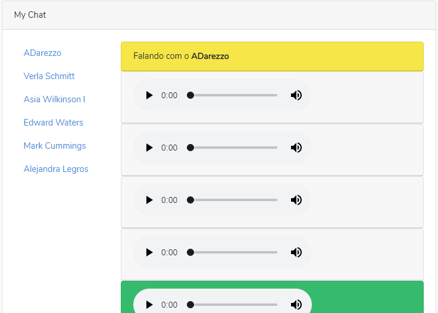
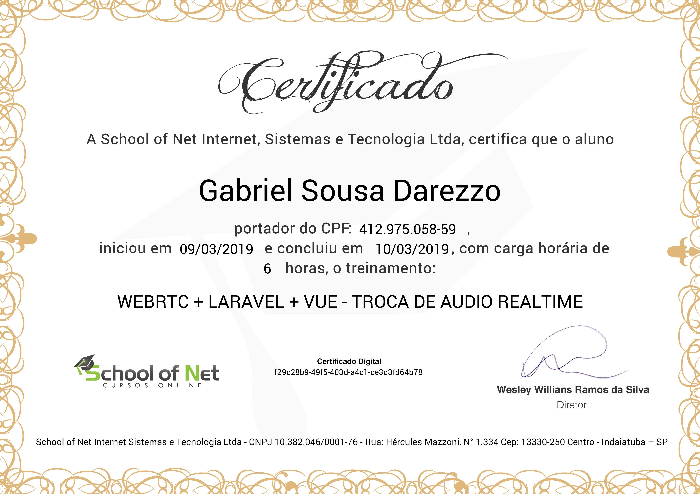

## WebRTC-App  
Sample teste with WebRTC + Larvel + VueJs  

<p align="center"></p>


Sample teste with WebRTC + Larvel + VueJs + Pusher (❤️RealTime❤️)

# Random Pic
   


-----
```sql
CREATE DATABASE webrtc COLLATE 'utf8_general_ci';
```


```bash
git clone https://github.com/gabrieldarezzo/webrtc-laravel-vue.git
cd webrtc-laravel-vue
composer update
```  
Update your '.env' file:   
```
DB_DATABASE=webrtc
DB_USERNAME=root
DB_PASSWORD=

BROADCAST_DRIVER=pusher

PUSHER_APP_ID=732169
PUSHER_APP_KEY=41e804129664dea402c6
PUSHER_APP_SECRET=d421071c14422387ed48
PUSHER_APP_CLUSTER=us2
```


Create Tables, and populate then
```bash
php artisan key:generate  
php artisan migrate
php artisan db:seed
```

# Start Laravel Serve
```bash
php artisan serve
```

# Install NPM Needs:  
```bash
npm install
```

# Start Laravel Serve 
```bash
npm run watch
```


# Drop all tables, and Create again seeding then   
```bash
php artisan migrate:refresh
php artisan db:seed
```

# Login Try Yourself:    

User 1:  
gabrieldarezzo@yahoo.com.br  
Pass:  
password  

User 2:  
teste@yahoo.com.br  
Pass:  
password  


# Certificado (isso vale algo?! kkkk)
   
   


